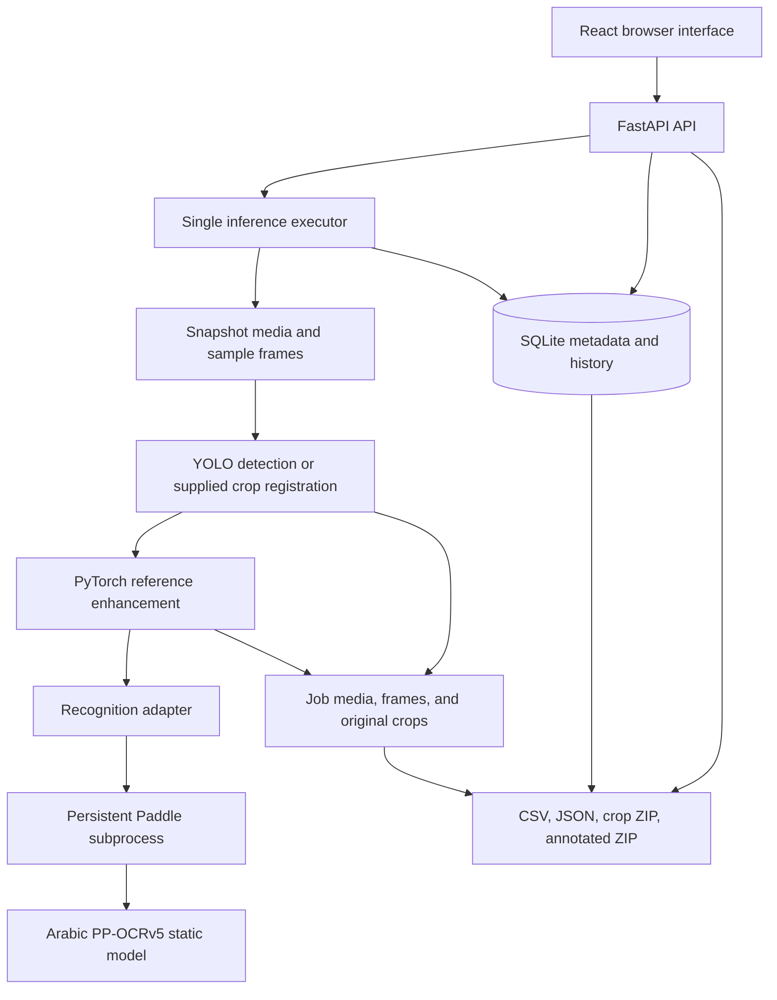

# How the full IRIS pipeline works

This guide explains the application implemented in `full pipeline/`: how media becomes plate crops, how crops are enhanced and recognized, how results are reviewed and stored, and how jobs and exports work. It describes the current source code as of October 4, 2026. For installation commands, see the [README](../README.md); for measured verification and outstanding acceptance work, see [implementation status](implementation-status.md).

## Contents

1. [What the pipeline produces](#1-what-the-pipeline-produces)
2. [Architecture and source map](#2-architecture-and-source-map)
3. [Startup and runtime environments](#3-startup-and-runtime-environments)
4. [A complete job from submission to results](#4-a-complete-job-from-submission-to-results)
5. [Input handling and video sampling](#5-input-handling-and-video-sampling)
6. [Detection and crop quality](#6-detection-and-crop-quality)
7. [Enhancement](#7-enhancement)
8. [OCR and Arabic text handling](#8-ocr-and-arabic-text-handling)
9. [Review flags and operator corrections](#9-review-flags-and-operator-corrections)
10. [Job states, cancellation, retries, and reruns](#10-job-states-cancellation-retries-and-reruns)
11. [Persistence, identifiers, and audit history](#11-persistence-identifiers-and-audit-history)
12. [The five application screens](#12-the-five-application-screens)
13. [Configuration reference](#13-configuration-reference)
14. [API reference and examples](#14-api-reference-and-examples)
15. [Exports and annotated video](#15-exports-and-annotated-video)
16. [Original-versus-enhanced accuracy comparisons](#16-original-versus-enhanced-accuracy-comparisons)
17. [Operation, diagnostics, and troubleshooting](#17-operation-diagnostics-and-troubleshooting)
18. [Current boundaries and verification](#18-current-boundaries-and-verification)

## 1. What the pipeline produces

The main processing path is:

```text
Vehicle image or sampled video frame
    → YOLO plate bounding boxes
    → saved original plate crops and quality measurements
    → enlarged, optionally enhanced plate crops
    → Arabic PP-OCRv5 recognition
    → reviewable results, history, and exports
```

When the input already contains cropped plates, YOLO is bypassed. Each image becomes one saved plate record and enters enhancement followed by OCR, depending on the selected stopping stage.

There are three independently meaningful measurements:

| Measurement | What it describes | Where it comes from |
| --- | --- | --- |
| Detector confidence | The detector's score for a plate box | YOLO; absent in supplied-crop mode |
| Crop quality | A heuristic combining size, character detail, contrast, edges, and detector confidence | The detection stage's image measurements |
| OCR confidence | Mean model score for the characters retained by CTC decoding | The recognition worker |

These values measure different things. None is an independently calibrated probability that the complete plate number is correct. A high-confidence reading can still be wrong, and a poor crop remains available for inspection.

The unit of output is a **detection at a particular source frame**, rather than a unique vehicle or unique plate number. Two boxes in one sampled frame produce two records. The same plate seen in ten sampled frames produces ten records. There is no tracking, temporal voting, or deduplication by recognized text.

## 2. Architecture and source map



Detection, enhancement, and OCR run as **whole-job passes**. For a full job, the application detects across all sources first, enhances all saved detections second, and recognizes all enhanced crops third. It does not complete all three stages on one frame before moving to the next frame.

The application is self-contained within this directory. It does not import the parent IRIS backend or frontend at runtime.

| File or directory | Responsibility |
| --- | --- |
| [backend/iris_pipeline/app.py](../backend/iris_pipeline/app.py) | FastAPI routes, application lifecycle, frontend serving, validation and artifact access |
| [backend/iris_pipeline/jobs.py](../backend/iris_pipeline/jobs.py) | Queue, job execution, stage ordering, snapshots, cancellation, retries, reruns, benchmark orchestration |
| [backend/iris_pipeline/media.py](../backend/iris_pipeline/media.py) | File discovery, Unicode-safe image reads/writes, timestamp-based video sampling |
| [backend/iris_pipeline/stages/detection.py](../backend/iris_pipeline/stages/detection.py) | YOLO inference, bounded crops, quality metrics and quality flags |
| [backend/iris_pipeline/stages/enhancement.py](../backend/iris_pipeline/stages/enhancement.py) | Adapter to the supplied enhancement algorithm |
| [plate_enhancement.py](../plate_enhancement.py) | Bicubic enlargement and conditional local contrast/sharpening implementation |
| [backend/iris_pipeline/stages/recognition.py](../backend/iris_pipeline/stages/recognition.py) | OCR archive validation, model cache, subprocess protocol, text parts |
| [backend/iris_pipeline/workers/paddle_worker.py](../backend/iris_pipeline/workers/paddle_worker.py) | Paddle predictor, recognition preprocessing and CTC decoding |
| [backend/iris_pipeline/runtime.py](../backend/iris_pipeline/runtime.py) | Device selection, reusable stage instances and actual inference diagnostics |
| [backend/iris_pipeline/db.py](../backend/iris_pipeline/db.py) | SQLite records, paginated queries, settings and audit histories |
| [backend/iris_pipeline/exports.py](../backend/iris_pipeline/exports.py) | Structured exports, crop archives, Arabic annotations and video re-encoding |
| [backend/iris_pipeline/accuracy.py](../backend/iris_pipeline/accuracy.py) | Text normalization, edit distance and aggregate accuracy metrics |
| [backend/iris_pipeline/schemas.py](../backend/iris_pipeline/schemas.py) | Validated job and API request options |
| [backend/iris_pipeline/config.py](../backend/iris_pipeline/config.py) | Root paths and environment configuration |
| [frontend/src/App.tsx](../frontend/src/App.tsx) | Analyze, Review, History, Pipeline / Settings, and Accuracy screens |
| [frontend/src/AuditHistory.tsx](../frontend/src/AuditHistory.tsx) | Readable prediction, enhancement and correction history |
| [scripts](../scripts) | Windows setup, launch, shutdown, diagnostics and verification utilities |

The active detector uses `best.pt`. `best.onnx` and `extract_license_plates_gpu_ocr.py` are supplied assets/reference material; the web application's processing path does not execute them. The OCR model comes from `v5_arabic_mobile-fine-tuned.zip`.

## 3. Startup and runtime environments

### Separate Python environments

Setup creates two environments:

| Environment | Runs | Main inference framework |
| --- | --- | --- |
| `.runtime/backend/` | FastAPI, jobs, detection, enhancement, exports | PyTorch and Ultralytics |
| `.runtime/paddle/` | The OCR subprocess | Paddle static inference |

Separating Paddle and PyTorch isolates their dependencies while allowing both stages to use the selected device. They communicate through the local filesystem and JSON messages, so no network service is needed between them.

The Windows setup script requires Python 3.11. Its CUDA installation selects PyTorch `2.6.0`, torchvision `0.21.0`, and Paddle GPU `3.2.0`, using CUDA 11.8 package sources. CPU installation is also supported. The frontend uses React, TypeScript and Vite, with Node.js needed for installation and builds.

### Startup sequence

1. `scripts/start.ps1` sets the backend module path and runs `scripts/launch-check.py` to verify the configured address/port is available. On success, it launches `python -m iris_pipeline` from the standalone root. The development launcher uses the same check. A conflict stops launch before models are loaded or job states are changed; the check does not reserve the port against a later competing process.
2. Settings are loaded from environment variables and the root `.env` file. Required data/runtime directories are created.
3. The SQLite database is opened and its tables/indexes are created if needed.
4. FastAPI's lifespan creates the job manager and exporter.
5. Jobs left `queued`, `running`, or `cancelling` by an earlier process become `failed`, with an interruption message. They remain available for an explicit retry.
6. Startup diagnostics enter the same single-worker executor used by jobs. New jobs wait behind these checks.
7. The backend serves `frontend/dist/` if a production build exists.

With default settings, the production UI and API share `http://127.0.0.1:8014`. Development uses Vite at `http://127.0.0.1:5187`, which proxies `/api` to the backend.

### Device selection and model lifetime

`IRIS_DEVICE=auto` selects `cuda:0` when PyTorch reports CUDA available; otherwise it selects `cpu`. An explicit `cpu` or `cuda:N` value selects that device. Auto selection does not guarantee that the separate Paddle installation is healthy; Paddle's actual execution is checked separately.

Stage objects are created on demand and retained for reuse. Startup diagnostics normally load all three. YOLO stays in the backend process, enhancement uses PyTorch in that process, and the OCR predictor stays in a persistent Paddle subprocess. Inference is performed one frame/crop at a time.

The executor has `max_workers=1`. Multiple submitted jobs can wait, but only one inference job or queued diagnostic operation executes at once. This limits concurrent GPU and memory pressure; it is an in-process queue rather than an external task broker.

## 4. A complete job from submission to results

Consider a vehicle-mode video submitted with `sample_fps=5` and `stop_after=ocr`.

1. **Validate inputs and options.** Supported paths are collected, duplicates of the same resolved path are removed, and the options schema checks values and stage combinations.
2. **Create the job.** A job ID is generated, source IDs such as `s00000` are assigned, and the original options are saved as `input_options`.
3. **Create a run.** A separate run ID records the starting stage, effective options, model-readiness metadata, status and later timings. The job is queued.
4. **Snapshot each source as it is reached.** The video is copied into the job's `media/` directory before decoding that source. Copying uses a temporary `.partial` file, renamed when complete.
5. **Decode and sample.** The first video stream is decoded sequentially. Actual timestamps select approximately five available frames per second for detection.
6. **Detect plates.** YOLO predicts boxes. Each valid box produces an original PNG crop, bounding box, detector score, quality measurements, review flags, and frame/timestamp association. A source-frame PNG is saved once for a sampled frame containing detections.
7. **Finish the detection pass.** After all sources have been processed, the job's `detection_complete` flag is set, including when no plates were found.
8. **Enhance saved originals.** Every saved crop is read, enlarged and conditionally adjusted. The enhanced PNG is stored under this run's own directory, and an enhancement-history entry is appended.
9. **Recognize enhanced crops.** Each enhanced file is sent to the persistent OCR worker by path. Raw text, confidence, digit/Arabic parts and review decisions are saved; prediction history receives an entry.
10. **Complete the run.** The job becomes `completed`; stage durations, total run duration and the actual saved detection count are persisted.
11. **Review and export.** The operator can compare crops, inspect source frames, correct readings and download artifacts.

For a two-second, 30 FPS video with timestamps beginning at zero, a five-samples-per-second setting selects frames near `0.0, 0.2, …, 1.8` seconds. If each selected frame contains two plates, that yields 20 detection records. This assumes the detector returns both plates at every selected time; sample count alone does not guarantee a detection count.

## 5. Input handling and video sampling

### Supported inputs

| Input type | Supported filename extensions |
| --- | --- |
| Images | `.jpg`, `.jpeg`, `.png`, `.bmp`, `.webp`, `.tif`, `.tiff` |
| Videos | `.mp4`, `.avi`, `.mov`, `.mkv`, `.m4v`, `.wmv`, `.flv`, `.webm` |

Extension support determines discovery; the actual file must still be decodable. Video handling uses the first video stream. Supplied-crop mode accepts images only.

**Uploads:** The browser sends multipart files and serialized job options. Folder uploads preserve relative source names. The backend rejects unsafe filenames, unsupported extensions, and videos in crop mode. Files are initially staged under `.data/uploads/<upload-id>/`, then copied into job media storage during execution. A staged uploaded file is removed after its complete job copy is in place.

**Local paths:** Paths refer to the backend computer. A folder scan includes its immediate files, or all descendants when `recursive=true`. Unsupported files are skipped. Missing explicitly supplied paths, a scan with no supported files, or a crop-mode scan containing a video produce an error.

The same resolved path is collected once within a submission. Different files with identical basenames remain separate sources because storage filenames use source IDs.

### Snapshot timing

Local files are copied source by source when the queued job executes. Submission does not immediately snapshot the whole folder. Keep a local source available and stable until its copy finishes. Once a snapshot exists, later processing and annotated exports use the saved copy, and retries reuse it. The application does not modify local originals.

Images are decoded as three-channel BGR arrays with `cv2.imdecode` and NumPy file reads, allowing non-ASCII Windows paths. Original and enhanced crops are written as lossless PNGs. Saving a JPEG input as a PNG crop does not restore detail already lost in the source JPEG.

### Timestamp-based sampling

The sampler uses PyAV presentation times, rather than a fixed integer frame stride:

```text
origin = time of first decoded frame
timestamp = current frame time - origin
next_target = 0

if timestamp + 0.000001 >= next_target:
    emit this frame
    next_target = (floor((timestamp + 0.000001) * sample_fps) + 1) / sample_fps
```

Consequences:

- The first available frame is sampled.
- Variable-frame-rate input follows its actual timestamps.
- When a target falls between frames, the first available frame at or after it is selected.
- A large gap advances to the next target after the emitted frame; missing frames are not synthesized.
- A sampling rate above the source frame rate can select every available frame but cannot create extra frames.
- Decoding still traverses the video; sampling reduces inference work, not the number of frames the decoder must encounter.
- A video frame without a usable timestamp fails the sampling pass with an explicit error.

`frame_index` is the zero-based index in the decoded source stream, not an index among sampled frames. `timestamp` is seconds relative to the first decoded frame. Images use index `0` and timestamp `0.0`.

## 6. Detection and crop quality

### YOLO inference and bounded crops

Vehicle mode loads `best.pt` through Ultralytics `YOLO`. Each inference call receives the BGR image, confidence threshold, IoU threshold, inference image size and selected device.

For each returned box:

1. Reject non-finite coordinates.
2. Round the left/top coordinates down and right/bottom coordinates up.
3. Clamp coordinates to the source image boundaries.
4. Reject boxes with empty width or height.
5. Measure quality on the **unpadded** bounding-box crop.
6. Save a crop with the configured pixel padding, clipped to the image boundaries.

The saved `bbox=[x1,y1,x2,y2]` describes the unpadded source coordinates. A crop may therefore be slightly larger than `quality.width × quality.height`. The saved source frame is the decoded image without export annotations.

YOLO's confidence threshold and non-maximum suppression affect which boxes reach the application. After a valid box is returned, this application does not discard it for blur, small size, poor contrast, or low crop quality.

In supplied-crop mode, the whole image is registered as one box, `[0,0,width,height]`, with `detector_confidence=null`. It receives the same quality measurements and saved-crop structure without a YOLO prediction.

### Character region and metrics

The quality estimator targets the expected character area of the supplied plate layout: approximately horizontal **8%–92%** and vertical **34%–92%** of the unpadded crop, with rounded and bounded coordinates.

Grayscale uses `0.114 × B + 0.587 × G + 0.299 × R` on a 0–255 scale. Brightness is measured over the whole crop; character contrast, sharpness and edges use the character region.

| Saved metric | Calculation |
| --- | --- |
| `width`, `height` | Unpadded crop dimensions in pixels |
| `brightness` | Mean whole-crop grayscale intensity |
| `contrast` | Character-region 90th percentile minus 10th percentile |
| `char_sharpness` | Population variance of the region's four-neighbor Laplacian response |
| `edge_strength` | Mean absolute horizontal Sobel response, with Sobel kernel divided by 8 |
| `edge_density` | Fraction of horizontal gradient values greater than 18 |
| `quality_score` | Weighted heuristic below |

Convolutions use replicate padding. A character region smaller than three pixels in either dimension receives zero sharpness, edge strength and edge density.

Let `c` be detector confidence, or zero when absent. The quality score is:

```text
size = 0.65 × min(width / 155, 1) + 0.35 × min(height / 48, 1)

quality_score =
    0.08 × c
  + 0.20 × size
  + 0.22 × min(char_sharpness / 110, 1)
  + 0.20 × min(contrast / 75, 1)
  + 0.20 × min(edge_strength / 20, 1)
  + 0.10 × min(edge_density / 0.18, 1)
```

This is a bounded weighted score, not a learned quality model. A supplied crop has no detector contribution, so its score cannot reach the same maximum as a crop with detector confidence one.

### Quality flags

| Flag | Condition |
| --- | --- |
| `small` | Width below 80 pixels or height below 24 pixels |
| `blurry` | Character sharpness below 17 |
| `low contrast` | Character contrast below 16 |
| `exposure` | Mean brightness below 25 or above 235 |
| `weak character edges` | Edge strength below 6 or edge density below 0.035 |
| `low crop quality` | Weighted quality score below the job's `review_quality`, default 0.36 |

These thresholds assume the supplied plate layout. Another plate design may put its characters outside the fixed region and require changes to the estimator.

## 7. Enhancement

The enhancement adapter imports the supplied `plate_enhancement.py` and calls its single-crop API **once per crop per enhancement run**. It always reads the saved original, so an enhancement rerun does not repeatedly sharpen an already enhanced image.

### Enlargement

The original BGR `uint8` crop becomes a float tensor scaled to `[0,1]` on the selected device. When `upscale > 1`, PyTorch bicubic interpolation enlarges it using `align_corners=False`. Default enlargement is 3× in both dimensions: a `160 × 48` crop becomes `480 × 144`.

An enlargement factor of one skips resizing. In all cases, output is clamped to the valid range and finally rounded back to BGR bytes for PNG storage.

### Conditional detail adjustment

The reference algorithm recomputes character sharpness and edge strength on the saved original crop. These measurements can differ slightly from detection quality because a detected original may contain padding.

Contrast and sharpening are applied only when all conditions hold:

```text
detail_enhancement is enabled
AND char_sharpness >= 55
AND edge_strength >= 11
```

If the gate passes:

1. Compute grayscale on the enlarged image.
2. Compute a 9×9 local average with replicate padding.
3. Add `0.07 × (gray - local_average)` to each color channel, then clamp.
4. Blur each channel using the 3×3 kernel `[[1,2,1],[2,4,2],[1,2,1]] / 16`.
5. Add `0.12 × (image - blur)`, then clamp again.

If the gate fails, only enlargement is used. Turning detail enhancement off forces the gate to fail while retaining the selected enlargement.

The gate intentionally applies the supplied algorithm's thresholds. A blurry or flat crop can receive `enlargement_only` even when the checkbox is enabled. Bicubic enlargement increases pixel dimensions; it does not reconstruct missing source characters.

### Saved result

Each version is stored at:

```text
enhanced/<run-id>/<detection-id>.png
```

Its history entry records the path, run ID, creation time, sharpness, edge strength, enlargement factor, detail setting and method (`enlargement_only` or `contrast_and_sharpening`). The detection's current `enhanced` field points to the newest version processed for that detection.

Enhancement clears the current raw reading, OCR confidence, digits and logical Arabic parts until OCR runs again. Previous prediction history remains available, and existing operator corrections remain stored. An enhancement-only rerun therefore does not provide a fresh OCR result for its new crop.

## 8. OCR and Arabic text handling

### Model extraction and validation

The recognition adapter computes the SHA-256 fingerprint of `v5_arabic_mobile-fine-tuned.zip`. Its first 16 hexadecimal characters name the model cache under `.data/models/`.

Only these archive members are extracted, using their basenames in the cache:

- `inference/inference.json`
- `inference/inference.pdiparams`
- `inference/inference.yml`
- `plate_dict.txt`

Existing cached files are compared with their archive content hashes and replaced when mismatched. Arbitrary ZIP entries are not extracted. The YAML character dictionary must match `plate_dict.txt` exactly.

The worker requires the exported model name `arabic_PP-OCRv5_mobile_rec` and postprocessor `CTCLabelDecode`. It loads the static model directly through Paddle inference. This is a recognition stage for an existing crop; it does not run another Paddle text detector, orientation classifier, or full-document OCR pipeline.

### Persistent worker protocol

The backend launches `.runtime/paddle/Scripts/python.exe` with `workers/paddle_worker.py`. The Windows process is hidden. Standard input/output carry one JSON request/response per line; diagnostic output goes to `.runtime/ocr-worker.log`.

A recognition request contains the model directory, device and saved crop path. The worker opens that file locally. Responses contain text and confidence; there is no base64 image transfer.

The same predictor handles subsequent requests. Requests are serialized with a lock and have an `IRIS_OCR_TIMEOUT` response timeout, default 120 seconds. A timeout, broken pipe or process exit fails the request and closes the worker; a subsequent request can start a new worker. Worker-reported errors surface as job failures.

CUDA configuration selects the requested GPU index and initializes Paddle's inference GPU pool with 128 MB; this is not a cap on total GPU usage. CPU configuration uses two math-library threads. The worker disables MKLDNN and enables memory optimization and Paddle's new inference IR.

### Recognition preprocessing

The worker reads the recognition shape from the export's `RecResizeImg` configuration. The supplied model uses three BGR channels, target height 48 and base width 320.

For a crop with aspect ratio `r = source_width / source_height`:

```text
canvas_width = int(target_height × max(base_width / target_height, r))
resized_width = min(canvas_width, ceil(target_height × r))
```

The crop is resized to `resized_width × target_height` with OpenCV's default linear interpolation. It becomes float32 CHW data and is normalized as:

```text
normalized = (pixel / 255 - 0.5) / 0.5
```

The result is placed at the left of a zero-filled tensor, with right padding to `canvas_width`, then a batch dimension is added. Very wide crops can expand the canvas beyond the base width. Channels remain BGR.

### CTC decoding and confidence

Model output must have shape `[batch, time_steps, dictionary_size + 1]`. Index zero is the CTC blank; other indices map to dictionary entries.

The decoder:

1. Selects the highest-scoring character index at each time step.
2. Collapses consecutive identical indices.
3. Removes blank indices.
4. Concatenates the remaining dictionary characters.
5. Averages the corresponding retained time-step scores for `ocr_confidence`; an empty reading receives zero.

A blank between repeated characters allows both occurrences to survive, as expected in CTC. The implementation uses greedy decoding, with no beam search, language model, spell correction or temporal consensus.

### Raw order, digits and logical Arabic

The archive's labels use **visual left-to-right character order**. The application preserves the decoder's exact string in `raw_text` and derives separate fields:

| Field | Derivation |
| --- | --- |
| `digits` | Decimal Unicode digits converted individually to ASCII, retaining their order |
| `visual_letters` | Characters in the Arabic U+0621–U+064A range, retaining raw order |
| `arabic_letters` | Reverse of `visual_letters`, for logical Arabic display |
| `complete` | One to four digits and one to three Arabic letters |

For an illustrative raw codepoint sequence `['1','2','3','ب','س','م']`, the digits are `123`, visual letters are `['ب','س','م']`, and logical Arabic letters are `['م','س','ب']`. Digits are not reversed. Bidirectional rendering can change how an Arabic string looks on screen, so codepoint order matters when labeling data.

`complete` is a length check, not validation against every legal plate layout. The Review screen separates left-to-right digits and right-to-left logical Arabic. Predictions and exports still preserve the original raw string.

## 9. Review flags and operator corrections

New detections initially have `needs_review=true`. Detection-only and enhancement-only jobs therefore remain available for review even without an OCR confidence.

After OCR, review flags are rebuilt from the detection's original quality metrics and current run options. They include quality flags, `low crop quality`, `low OCR confidence` when confidence is below `review_confidence`, and `incomplete reading` when the digit/letter length check fails. Benchmarks additionally flag `ground-truth mismatch` for an incorrect normalized enhanced reading.

A result needs review when it has flags and has not already been marked reviewed. An operator correction:

- Appends a correction entry containing text, note, previous corrected text and UTC creation time.
- Sets `corrected_text` and `reviewed=true`.
- Clears `needs_review`.
- Preserves raw OCR predictions, OCR confidence, digit/letter fields and prediction history.

Corrections are allowed only after a job leaves `queued`, `running`, or `cancelling`. The text limit is 100 characters and the note limit is 1,000. Empty correction text is accepted.

Saved corrections remain through downstream reruns, and the existing reviewed marker suppresses automatic review even when a new reading has flags. Inspect rerun results manually when deciding whether a prior correction still applies. Corrections do not retrain the model or alter benchmark truth/scores.

The UI displays corrected text preferentially while keeping raw OCR visible. Annotated exports also prefer a correction. CSV/JSON retain separate raw and corrected fields. There is no operator identity field or correction authentication in the current local application.

## 10. Job states, cancellation, retries, and reruns

### Job versus run

A **job** owns input sources, saved detections and artifacts. A **run** is one execution attempt against that job, including initial processing, retry or downstream rerun.

`job.input_options` preserves the initial input configuration. `job.options` contains the latest submitted run's configuration. Every run also stores its own options and model-readiness snapshot.

| State | Meaning |
| --- | --- |
| `queued` | Waiting for the single executor |
| `running` | Executing a processing pass |
| `cancelling` | Cancellation requested; waiting for a cooperative check |
| `completed` | All requested stages returned successfully |
| `cancelled` | Execution observed the cancellation flag |
| `failed` | An exception or application interruption prevented completion |

The job's processing `stage` separately describes `queued`, `detect`, `enhance`, `ocr`, or `complete`. A completed detection-only job is still `completed`: completion refers to the requested scope.

### Cancellation

Cancel sets a persisted flag. The executor checks it between copy chunks, frames, detections and crops. Cancellation waits for an in-flight model call to return; it does not interrupt a CUDA kernel or immediately kill the OCR worker.

A queued job enters `cancelling` but reaches `cancelled` when its executor task runs and sees the flag. Saved outputs are retained. Closing the application requests cancellation of active work and shuts down the worker; a forced shutdown can leave interruption recovery for the next startup.

### Retry

The retry endpoint accepts only failed or cancelled jobs. It creates a new run using the previous run's **starting stage** and the job's latest options.

- If a detection pass finished and `detection_complete=true`, a detect-starting retry skips detection and runs the requested downstream passes.
- If detection was interrupted, it starts the detection pass again from the sources, reusing saved source snapshots. It does not seek directly to the last processed frame.
- Detection IDs are deterministic from job ID, source ID, decoded frame index and detection ordinal. Reprocessing the same ordered boxes replaces their current records instead of appending duplicate IDs.
- Enhancement and OCR retries iterate the whole saved crop set, rather than only unfinished crops. They append new history entries and enhancement versions where applicable.

Stable IDs depend on the same input and detector ordering. They are not tracking identities. An incomplete detection retry can replace existing current detection records, including current review fields, so finish retrying detection before curating corrections.

### Enhancement rerun

A downstream enhancement rerun requires saved crops and an inactive job. It reads every original crop, writes a new enhancement version, and optionally runs OCR when `stop_after=ocr`. A supplied `stop_after=detect` is coerced to `enhance` for this operation.

The Review button uses the options currently edited in the UI. Check the enlargement, detail and stopping settings before clicking it. Changes to detector confidence, IoU, image size, padding or video sample rate do not recreate existing detections during a downstream rerun. Submit a new analysis job to change detection/sampling.

### OCR rerun

An OCR rerun requires an enhanced crop for **every** saved detection. It forces `stop_after=ocr`, reads each detection's current enhanced file and appends predictions without creating new enhancement versions. It keeps job/detection IDs and saved corrections.

After a partially completed enhancement pass, some detections may point to new versions and others to older versions. An OCR rerun uses those current pointers; rerun enhancement to completion first when a uniform configuration is required.

### Progress and timings

Server-sent events expose changed job records about every 0.5 seconds, with heartbeat comments when unchanged. The stream ends at a terminal state.

During detection, progress contains a zero-based source index, source count, current source name, sampled-frame count for that source and a running detection count. This is not a reliable percentage of total video time. Enhancement/OCR progress reports processed crops and total saved crops.

The UI receives active job metadata through events and polls jobs/readiness every five seconds. Detection cards refresh on job completion or manual **Refresh results**; they are not fetched automatically for every saved crop.

Run timings are wall-clock seconds for successful stage passes. A stage that fails before returning has no completed-stage timing entry. Total run duration excludes time spent waiting in the queue. `detections_per_second` is the job's current total saved detections divided by that run's duration; it is not video FPS, unique-vehicle throughput, or a pure model-inference speed measurement.

## 11. Persistence, identifiers, and audit history

### Files on disk

```text
full pipeline/
├── best.pt
├── v5_arabic_mobile-fine-tuned.zip
├── plate_enhancement.py
├── .env
├── .runtime/
│   ├── backend/                     Backend environment
│   ├── paddle/                      OCR environment
│   ├── ocr-worker.log
│   ├── server.out.log / server.err.log
│   ├── server.pid                   Background launcher PID
│   └── diagnostics.json             Generated by diagnostics script
└── .data/
    ├── pipeline.sqlite3
    ├── models/<archive-hash-prefix>/ OCR inference assets
    ├── uploads/<upload-id>/          Staged uploads until copied
    └── jobs/<job-id>/
        ├── media/s00000.<extension>
        ├── frames/s00000_000000000.png
        ├── crops/<detection-id>.png
        ├── enhanced/<run-id>/<detection-id>.png
        └── exports/
            ├── csv.csv
            ├── json.json
            ├── crops.zip
            └── annotated.zip
```

Additional source files, enhancement runs, temporary copy files and export intermediates can exist. Source-frame PNGs are saved only for sampled frames that contain a detection, and multiple detections in that frame reference the same PNG.

### SQLite tables

SQLite uses write-ahead logging. Records mostly store JSON payloads, with selected columns/indexes supporting queries. Writes are serialized with a process-local lock; reads open short-lived connections.

| Table | Stores |
| --- | --- |
| `jobs` | Job identity, sources, options, status, progress, errors, counts and latest benchmark aggregates |
| `detections` | Current detection payload, source identity, indexed review flag and current OCR confidence |
| `runs` | Execution attempts, options, stage, model metadata, status and timing |
| `predictions` | Append-only OCR readings linked to detection and run |
| `enhancements` | Append-only enhancement metadata linked to detection and run |
| `corrections` | Append-only operator correction events linked to detection |
| `settings` | Saved processing defaults and named presets |

Job and run IDs are independently generated UUIDs. Source IDs are sequential within a job. Detection UUIDs are derived from the job/source/frame/ordinal tuple.

### Current record versus history

The detection record is the current view: original crop, latest enhanced pointer, latest OCR reading, quality flags and corrected text. Its history contains all recorded enhancement versions, predictions and corrections in insertion order.

A prediction records raw text, confidence, text parts, input crop path, run ID, UTC creation time and OCR archive SHA-256. An enhancement records its own path, method and settings. Run model metadata includes detector, enhancement-source and OCR archive fingerprints when diagnostics succeeded.

Downstream reruns retain historical files and entries. Saving a new enhancement moves the current pointer; it does not erase the old PNG. Repeating an export regenerates that export filename from current records; export files themselves are not versioned by run.

Detection listing and stage iteration use database pagination; crop passes process batches of up to 100 records. Files and histories still grow with detections and reruns. There is no automatic retention policy or job-delete API.

For a consistent portable backup, stop the application and copy `.data/` together with the model assets, configuration and application code. Recreate `.runtime/` environments on another computer using setup. Copying only the SQLite file omits the images and videos referenced by records.

## 12. The five application screens

| Screen | Main workflow |
| --- | --- |
| **Analyze** | Select uploaded files/folder or backend-local paths; select mode, stopping stage and processing options; apply a preset; submit a job |
| **Review** | Open a saved job; compare original/current enhanced crops; inspect OCR, separate confidence values, quality flags, source frame and histories; filter, correct and rerun |
| **History** | Browse jobs in pages of 50; reopen, cancel or retry; download exports; inspect run/stage timings |
| **Pipeline / Settings** | Inspect actual model/device readiness; queue diagnostics; edit basic/advanced defaults and named presets |
| **Accuracy** | Submit a local labeled-crop manifest; compare original/enhanced aggregate metrics; open saved comparisons and inspect sample predictions |

Review lists 30 detections per page. Source, needs-review and maximum-OCR-confidence filters are applied by the backend. A maximum-confidence filter includes records with no OCR confidence, which keeps unrecognized crops visible.

Defaults/presets persist when **Save settings** is used. Adding/removing a preset changes the UI state first. Applying a preset changes the options for future submission; it does not modify an existing job's saved run configuration. Job and benchmark selectors use the currently loaded history page.

## 13. Configuration reference

### Job options

These defaults come from the backend's `JobOptions` schema and match the initial frontend defaults.

| Option | Default | Valid values | Effect |
| --- | --- | --- | --- |
| `mode` | `vehicle` | `vehicle`, `crop` | YOLO input or already-cropped images |
| `stop_after` | `ocr` | `detect`, `enhance`, `ocr` | Last requested stage; crop mode rejects `detect` |
| `sample_fps` | `5` | Greater than 0, at most 60 | Timestamp sampling rate for videos |
| `confidence` | `0.4` | 0.01–1 | YOLO confidence threshold |
| `iou` | `0.45` | 0.01–1 | YOLO non-maximum-suppression IoU threshold |
| `image_size` | `1280` | 320–2048, multiple of 32 | YOLO inference image size |
| `padding` | `1` | Integer 0–100 | Pixels added around saved detected crops |
| `upscale` | `3` | Integer 1–6 | Enhancement enlargement factor |
| `detail_enhancement` | `true` | Boolean | Permit gated local contrast and sharpening |
| `review_confidence` | `0.8` | 0–1 | Flag readings below this OCR confidence |
| `review_quality` | `0.36` | 0–1 | Flag crops below this weighted quality score |

Lowering a review threshold changes review decisions, not predictions. Lowering detector confidence can increase both detections and false positives. Sampling more frequently increases retained sightings, inference work and storage. Enlargement increases crop pixels approximately with the square of its factor before OCR preprocessing.

Saved settings are loaded by the frontend and sent explicitly with jobs. A direct API request that omits `options` uses schema defaults; it does not automatically adopt the defaults saved in SQLite. Capture and pass the intended options when scripting reproducible runs.

### Environment options

| Variable | Default | Purpose |
| --- | --- | --- |
| `IRIS_HOST` | `127.0.0.1` | Backend bind address |
| `IRIS_PORT` | `8014` | Backend and production UI port |
| `IRIS_FRONTEND_PORT` | `5187` | Vite development port and allowed development origins |
| `IRIS_DEVICE` | `auto` | Runtime device selection |
| `IRIS_OCR_TIMEOUT` | `120` | Seconds to wait for a worker response |
| `IRIS_ANNOTATION_FONT` | Empty | Optional Arabic-capable TrueType font path |

The root defaults to the directory containing this standalone application's backend, independent of the terminal's working directory. Settings also support `IRIS_ROOT` as a root override; normal launch scripts assume the standalone directory layout, so keep that layout consistent.

Restart the backend after environment changes. CPU installation and runtime selection are separate choices: setup's `-Device cpu` selects packages, while `IRIS_DEVICE=cpu` selects the runtime device.

## 14. API reference and examples

The API lives under `/api`. FastAPI's interactive API documentation is available at `http://127.0.0.1:8014/docs` with the default port.

| Method | Path | Purpose |
| --- | --- | --- |
| GET | `/api/health` | Latest readiness/device snapshot |
| POST | `/api/diagnostics` | Queue fresh real inference checks; returns `scheduled` |
| GET / PUT | `/api/settings` | Read/save `defaults` and named `presets` |
| GET | `/api/jobs` | Paginated jobs; `offset`, `limit` |
| POST | `/api/jobs/paths` | Submit paths, recursive flag and options |
| POST | `/api/jobs/upload` | Multipart `files` and JSON-string `options` |
| GET | `/api/jobs/{job_id}` | Current job and run list |
| POST | `/api/jobs/{job_id}/cancel` | Request cooperative cancellation |
| POST | `/api/jobs/{job_id}/retry` | Retry failed/cancelled work |
| POST | `/api/jobs/{job_id}/rerun` | Rerun `enhance` or `ocr`, optionally with options |
| GET | `/api/jobs/{job_id}/events` | Server-sent job updates |
| GET | `/api/jobs/{job_id}/detections` | Paginated/filterable detection records |
| GET | `/api/detections/{detection_id}/history` | Prediction, enhancement and correction histories |
| POST | `/api/detections/{detection_id}/correction` | Save `text` and optional `note` |
| GET | `/api/jobs/{job_id}/artifacts/{relative}` | Serve a saved file inside this job's directory |
| GET | `/api/jobs/{job_id}/export/{kind}` | Generate/download `csv`, `json`, `crops`, or `annotated` |
| POST | `/api/benchmarks` | Submit local manifest path and comparison options |

Job pages default to 50 items; detection pages default to 30. Both accept a maximum limit of 200. Detection filters are `source` (source ID), `review` (boolean) and `max_confidence` (0–1).

Missing records return 404, application value errors return 400, and request-schema validation errors return 422. Corrections on active jobs and retries of jobs in the wrong state return 409. Unhandled filesystem/other exceptions may return 500. Artifact paths are resolved and checked to remain within the job directory.

### Submit and inspect a vehicle job with PowerShell

Replace the example path with an existing file or folder on the backend computer:

```powershell
$pipelineApi = 'http://127.0.0.1:8014/api'
$requestBody = @{
    paths = @('C:/camera/recording.mp4')
    recursive = $false
    options = @{
        mode = 'vehicle'
        stop_after = 'ocr'
        sample_fps = 5
        confidence = 0.4
    }
} | ConvertTo-Json -Depth 5

$pipelineJob = Invoke-RestMethod -Method Post -Uri "$pipelineApi/jobs/paths" `
    -ContentType 'application/json' -Body $requestBody

# Read current state; creation returns before processing finishes.
Invoke-RestMethod -Uri "$pipelineApi/jobs/$($pipelineJob.id)"

# Read the first result page, including unfinished crops if processing is active.
$resultPage = Invoke-RestMethod -Uri "$pipelineApi/jobs/$($pipelineJob.id)/detections?limit=30"
```

To submit already-cropped images, use `mode='crop'` and `stop_after='enhance'` or `'ocr'`. Other omitted option fields receive schema defaults.

### Rerun OCR and save a correction

Run these only after the job is inactive and enhanced crops exist. Correction uses an actual returned detection ID:

```powershell
Invoke-RestMethod -Method Post -Uri "$pipelineApi/jobs/$($pipelineJob.id)/rerun" `
    -ContentType 'application/json' -Body '{"stage":"ocr"}'

# After that run finishes, load detections again and choose the intended plate.
$resultPage = Invoke-RestMethod -Uri "$pipelineApi/jobs/$($pipelineJob.id)/detections?limit=30"
$detectionId = $resultPage.items[0].id
$correctionBody = @{text='123 مسب'; note='Checked against the source frame'} | ConvertTo-Json
$correctionBytes = [System.Text.Encoding]::UTF8.GetBytes($correctionBody)
Invoke-RestMethod -Method Post -Uri "$pipelineApi/detections/$detectionId/correction" `
    -ContentType 'application/json; charset=utf-8' -Body $correctionBytes
```

The UTF-8 byte conversion preserves Arabic text in Windows PowerShell requests. Saving a correction does not modify the raw OCR reading.

## 15. Exports and annotated video

Exports are allowed after a job leaves active states, including failed/cancelled jobs with partial results. They are generated on request under the job's `exports/` directory. A process-local exporter lock serializes export generation.

| Kind | Contents |
| --- | --- |
| `csv` | One row per current detection: identity/source, frame/time/bbox, raw and corrected text, digits/logical Arabic, detector/OCR confidence, review flags and eight numeric quality fields |
| `json` | Job, all runs, every current detection and its full prediction/enhancement/correction history |
| `crops` | ZIP of original crops and every recorded enhancement version, plus `manifest.jsonl` and `job.json` |
| `annotated` | ZIP of source-ID-named annotated images/videos and a `sources.json` mapping |

CSV uses UTF-8 with BOM for spreadsheet compatibility. Bounding boxes are JSON strings and review flags are separated by semicolons. JSON and JSON-lines output preserve Unicode. JSON generation and crop iteration write progressively rather than assembling all image data in memory.

The crop ZIP is not a complete copy of source media and frames. The JSON export contains metadata and relative artifact references; it does not embed images. Use a `.data/` backup when all evidence files must move together.

### Annotation labels and Arabic shaping

Image exports draw every saved source detection. Labels prefer `corrected_text`; otherwise they combine digits and logical Arabic letters. Empty labels use `Plate`. Boxes use a green outline.

Font selection tries `IRIS_ANNOTATION_FONT`, Windows Arial, then a Linux DejaVu Sans path. Pillow's RAQM layout is used when available; otherwise `arabic_reshaper` and `python-bidi` shape/reorder the label. Export fails with a font-setting message if no candidate TrueType font is found.

### Video export

Annotated video decodes every source frame and writes H.264 MP4 using `libx264`, CRF 20 and preset `fast`. Source dimensions are retained. Even dimensions use `yuv420p`; odd dimensions use `yuv444p`.

Frame presentation timestamps and time bases are passed into the encoder, including the encoder's time base, to preserve the source timing pattern for constant- and variable-frame-rate media. Source audio packets are remuxed using copied stream templates where the codecs are compatible with MP4.

When a sampled frame has detections, those boxes become active. They remain displayed for less than `1 / original_sample_fps` seconds, then expire. The interval comes from `job.input_options`, so changing options in a later enhancement/OCR run does not alter the original sampling interval. A new detection group replaces the preceding group.

There is no box tracking or interpolation between samples. A displayed box can remain stationary briefly while a vehicle moves, and an unsampled frame is not evidence of a new inference. The video is re-encoded, so original compression, byte identity and all container metadata are not retained. Representative audio/codec compatibility still needs acceptance testing.

The frontend downloads exports with `fetch(...).blob()`, buffering the completed file in browser memory. Very large exports therefore need attention to browser memory and disk capacity. An incomplete job whose later sources were never snapshotted may fail annotated export when those saved media files are absent; CSV/JSON/crop exports can still describe its saved detections.

## 16. Original-versus-enhanced accuracy comparisons

Accuracy mode measures the recognition effect of enhancement on **the same supplied crop**. It does not measure YOLO detection recall, full-vehicle accuracy or unique-plate recognition across a video.

Create a UTF-8 JSON file containing a nonempty list:

```json
[
  {"path": "plate-01.png", "truth": "123بسم"},
  {"path": "camera-b/plate-02.png", "truth": "456دم"}
]
```

Paths may be absolute or relative to the manifest directory. Each row must reference an existing supported image with nonempty string truth. Duplicate resolved image paths are rejected. Truth must follow the model's raw visual character order; see [benchmark labeling instructions](benchmark.md).

Submission forces crop mode and a full OCR pass. The job snapshots each image, creates one crop record per image, enhances it, then reads both variants using the same recognizer: enhanced first and original second. Both predictions, their input paths, confidences, model hashes and truth are retained.

### Normalization

Both truth and prediction are normalized before scoring:

1. Apply Unicode NFC normalization.
2. Remove whitespace.
3. Convert decimal Unicode digits to ASCII.
4. Map `أ`, `إ`, `آ` to `ا`; `ى` to `ي`; and `ة` to `ه`.

Scoring does not reverse Arabic strings. Label order must already match raw CTC order. Raw labels/predictions remain stored even when normalized strings compare equal.

### Metrics

Let `d_i` be Levenshtein edit distance between normalized truth and prediction for sample `i`, and `N` be the sample count.

```text
normalized exact-match accuracy = number of equal normalized strings / N

character error rate (CER) = sum(d_i) / sum(normalized truth lengths)

normalized edit similarity =
    mean(1 - d_i / max(truth_length_i, prediction_length_i, 1))
```

CER can exceed 100% when insertions make the total edit count exceed truth characters. Similarity is averaged per sample; CER is aggregated over characters, so their weighting differs.

Per-detection comparisons are saved as processing advances. Aggregate original/enhanced metrics are written after the complete OCR comparison pass. The job stores the latest aggregate and its run ID; historical predictions/run options remain available, but the aggregate object is replaced on a later successful comparison run. If a rerun fails, an older aggregate may remain, so check its run ID and the current job state.

Operator corrections do not change these metrics. The archive's reported held-out measurements and the small implementation smoke sample are separate from representative application acceptance scores.

## 17. Operation, diagnostics, and troubleshooting

From the standalone `full pipeline/` directory:

```powershell
# Install/recreate environments, build the frontend, verify models.
./scripts/setup.ps1

# Start the production UI/API in this terminal.
./scripts/start.ps1

# Alternatively, launch a hidden background instance and later stop its process tree.
./scripts/start.ps1 -Background
./scripts/stop.ps1

# Use Vite with a background backend during frontend development.
./scripts/start-dev.ps1

# Run actual framework/model checks and save .runtime/diagnostics.json.
./scripts/diagnostics.ps1

# Run backend tests, then build the frontend.
./scripts/verify.ps1
```

Do not launch foreground/background instances simultaneously on the same port. Production launch requires an installed backend environment and built frontend. In production, rebuilding `frontend/dist/` is necessary before frontend source edits appear.

### What diagnostics actually check

Diagnostics execute work rather than checking package names alone:

- PyTorch CUDA device information and a real 32×32 matrix multiplication when CUDA is selected.
- Supplied YOLO inference on a synthetic blank image.
- Reference enhancement and its expected default 3× output shape.
- A separate Paddle 16×16 matrix multiplication on its selected device.
- Actual static OCR model inference on a synthetic crop.
- Stage readiness, execution errors and model/source fingerprints.

Health begins at `checking`. After diagnostics, it becomes `ready` when every stage check succeeds or `attention` when a stage fails. `GET /api/health` returns the last stored snapshot; it does not trigger fresh inference. `POST /api/diagnostics` schedules checks behind current inference work, so the snapshot updates when they finish. Blank-image success verifies execution, not recognition accuracy on camera footage.

### Useful logs and failure checks

| Symptom | Check |
| --- | --- |
| OCR runtime missing | Confirm `.runtime/paddle/` exists; recreate environments with setup |
| OCR timeout/model error | Inspect `.runtime/ocr-worker.log`, the job error and OCR readiness; verify the archive and Paddle device execution |
| Detector/enhancement CUDA error | Inspect stage readiness and backend error log; confirm the installed backend environment and selected device |
| UI missing or stale | Confirm `frontend/dist/index.html`; build the frontend and restart as needed |
| Source path rejected | Use a path on the backend computer; verify existence, extension, recursive flag and selected input mode |
| No detections | Inspect source frames/settings and representative footage; confirm mode and detector readiness; a completed job can contain zero plates |
| OCR rerun rejected | Finish enhancement for every saved crop before rerunning OCR |
| Correction/export rejected | Wait until the job leaves active states |
| Annotated export font error | Set `IRIS_ANNOTATION_FONT` to an installed Arabic-capable TrueType font |
| Interrupted job after restart | Open History and Retry; saved work remains, with the retry behavior described above |
| Memory/disk pressure | Run verification/builds separately from inference; inspect accumulating media, source frames, crop versions and exports |

Background launch logs go to `.runtime/server.out.log` and `.runtime/server.err.log`; development backend logs use `.runtime/backend.out.log` and `.runtime/backend.err.log`. `stop.ps1` checks the saved launcher belongs to this application and stops its descendant process tree, including the OCR worker.

On the verified 8 GB RAM computer, stop the background application before backend verification or a frontend build, run those checks sequentially, and restart for browser/real-inference checks. GPU installation downloads/unpacking can need more than 15 GB free space in addition to ongoing job storage.

The default bind address is local. The current application has no authentication or user roles, and local-path submission accesses files available to the backend process. Hosting beyond the intended local environment requires a separate deployment design.

## 18. Current boundaries and verification

The implementation has verified real PyTorch/Paddle GPU execution, supplied model loading, a multi-plate image, timestamp-sampled video, downstream reruns and the four export types. Automated tests cover the control/data flow using controlled model substitutes, while the live smoke script uses the supplied assets. See [implementation status](implementation-status.md) for the specific results and remaining work.

The current pipeline does not include tracking, unique-plate aggregation, perspective rectification, learned super-resolution, temporal OCR consensus, correction-driven training, automatic retention, authentication or distributed workers. It preserves sampled evidence and separate measurements for operator review.

Representative full vehicle photos and actual camera recordings remain necessary to establish detection and OCR performance. The verified synthetic video was made from real crops, so it does not establish camera accuracy under night lighting, motion blur, occlusion or prolonged operation. Long-job storage, large exports, audio/codec combinations and installation on another computer also need deployment acceptance testing.

For changes to behavior, begin with the source map in section 2 and keep this guide, the [README](../README.md), [benchmark instructions](benchmark.md), and [implementation status](implementation-status.md) aligned with the resulting implementation.
